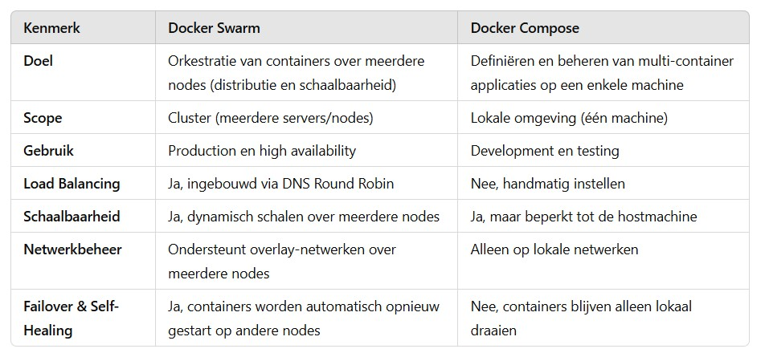

# tutorial docker swarm

Docker Swarm is een native clustering en orkestratie-oplossing voor Docker-containers. Het stelt je in staat om een cluster van Docker-hosts te beheren als één enkele virtuele machine. Swarm regelt schaalbaarheid, load balancing en failover, zodat je applicaties robuuster en beter beheersbaar worden.

Met Docker Swarm kan je:

- Containers schalen over meerdere nodes.
- Automatisch falende containers vervangen.
- Load balancing toepassen via ingebouwde DNS-based service discovery.

Docker Swarm is ingebouwd in Docker, wat betekent dat je geen extra software nodig hebt om het te gebruiken.

## Wat is het verschil tussen Docker Swarm en Docker Compose?

## Wanneer kies je welke?
Gebruik Docker Compose voor development en testing. Het is handig als je meerdere containers wilt beheren op je lokale machine (bijvoorbeeld een webserver + database).
Gebruik Docker Swarm als je een productieomgeving met meerdere servers hebt en schaalbaarheid en failover nodig hebt.

## architectuur

2 fysieke servers, georkesteerd door docker swarm.

## setup docker swarm
https://www.linuxlearninghub.com/docker-swarm-made-easy-a-step-by-step-tutorial-series/

